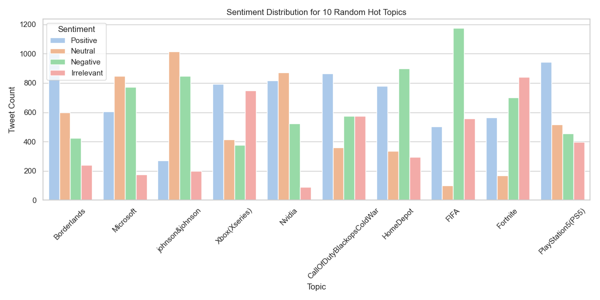

# Task 4: Sentiment Analysis and Visualization of Social Media Data

Analyze and visualize sentiment patterns in social media data to understand public opinion and attitudes toward specific topics or brands.


## 📊 Objective

The objective of this task is to perform sentiment analysis on tweets and visualize public sentiment (Positive, Neutral, Negative) towards various entities or topics. This helps identify how people feel about different brands or subjects based on their online expression.


## 📁 Dataset

Dataset used: **Twitter Entity Sentiment Analysis** from Kaggle

**File:** `dataset.csv`

**Columns:**
- ID: Tweet identifier
- Entity: The brand or topic mentioned (e.g., Borderlands)
- Sentiment: The labeled sentiment of the tweet (Positive, Neutral, Negative)
- Text: The actual tweet content


## 🛠️ Technologies Used

- Python
- Pandas
- Seaborn
- Matplotlib
- Random


## 📦 Dependencies

Install the required libraries using the following commands:
```bash
pip install pandas seaborn matplotlib  
```


## 📌 Output

- A bar chart showing the sentiment distribution (Positive, Neutral, Negative) for 10 randomly selected entities from the dataset.
- Output image is saved as: **`hot_topics_sentiment_distribution.png`**


## 🚀 How to Run

1. Ensure your Python environment is ready.
2. Place the `dataset.csv` file in your working directory.
3. Run the Python script:
```bash
python script.py
```
4. The bar chart will be saved and displayed.


## 📈 Result

- The output displays sentiment distribution for 10 random topics.
- Useful for understanding general opinions, brand perception, and public mood toward each entity.
- **Sentiment Distribution for 10 Random Hot Topics**

  

## ✅ Task Completed

Task 4 completed successfully with random topic selection, sentiment analysis, and visualization using Python and Seaborn.
